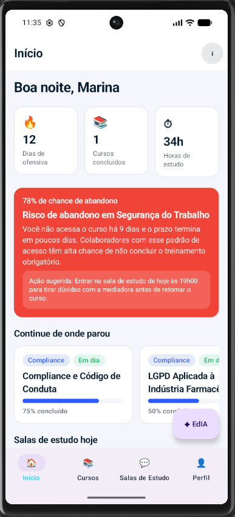
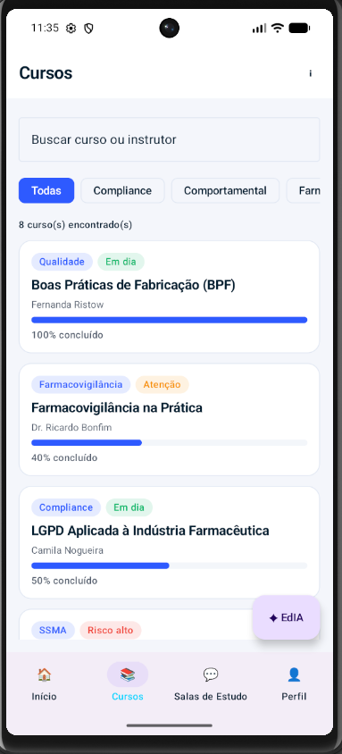
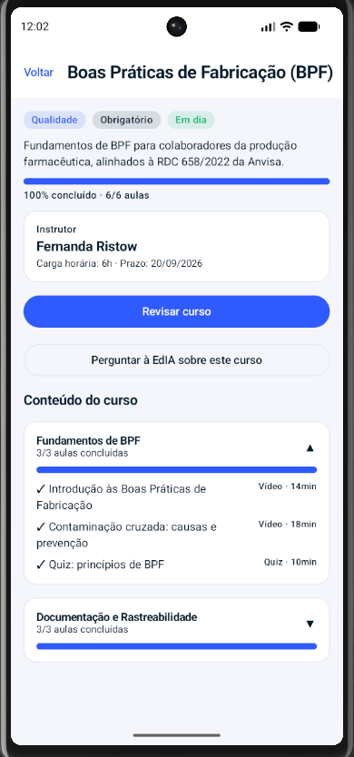
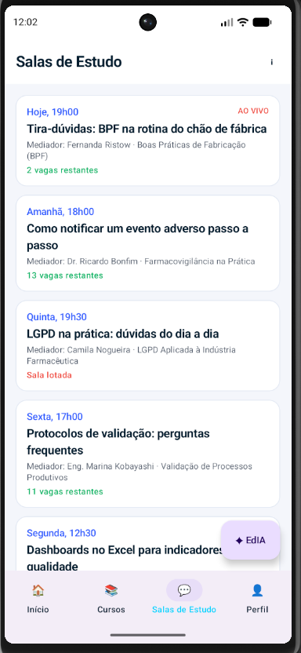
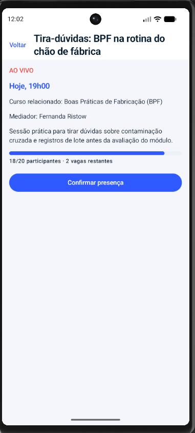
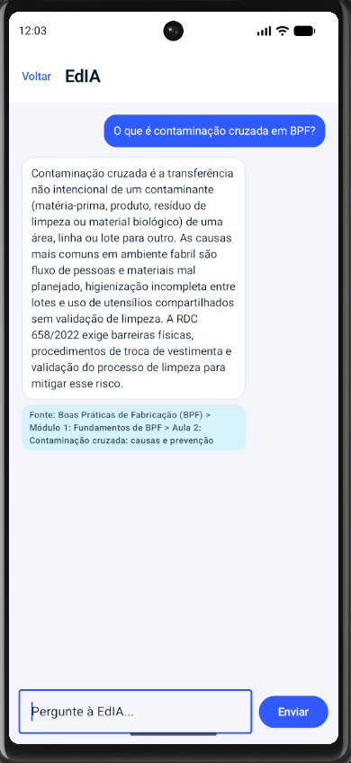
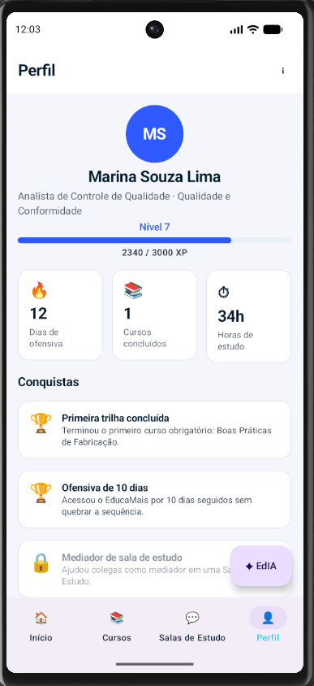
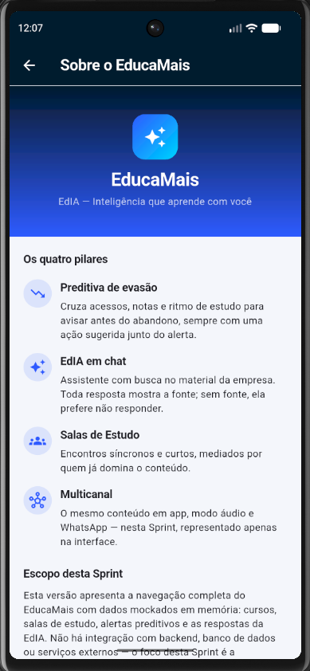

# EducaMais

Aplicativo desenvolvido para a Sprint de Desenvolvimento Mobile.
EducaMais é a camada de inteligência do assistente **EdIA** — *"Inteligência
que aprende com você"* — construída sobre o Moodle e o sistema legado de
treinamentos de uma indústria farmacêutica.

## Identificação do grupo

**Nome da equipe:** EducaMais

**Repositório GitHub:** https://github.com/juan-marini/flutter_2sem_sprint

| Nome | RM |
|---|---|
| Samuel Okuma | 555370 |
| Juan Marini | 556678 |
| Eduardo Antunes | 555534 |
| Romeo Miranda | 557025 |
| Arthur Menon | 555918 |

## Descrição do projeto

O público do EducaMais são colaboradores de uma indústria farmacêutica
fazendo treinamentos obrigatórios (Boas Práticas de Fabricação,
Farmacovigilância, LGPD, Validação de Processos, Segurança do Trabalho,
Compliance). O app não é um LMS — é uma camada de inteligência sobre um,
com quatro pilares:

1. **Preditiva de evasão** — cruza acessos, notas e ritmo de estudo para
   avisar antes do abandono, sempre com uma ação sugerida junto do alerta.
2. **EdIA em chat** — assistente com busca no material da empresa. Regra
   de zero alucinação: toda resposta mostra a fonte exata no material;
   sem fonte, ela prefere não responder.
3. **Salas de Estudo** — encontros síncronos e curtos, mediados por quem
   já domina o conteúdo.
4. **Multicanal** — o mesmo conteúdo em app, modo áudio e WhatsApp
   (nesta Sprint, representado apenas na interface).

Esta é uma entrega de **MVP navegável**: todos os dados são mockados em
memória, sem nenhuma dependência externa, backend ou banco de dados. O
foco é a experiência de navegação e a interface.

## Como executar

Pré-requisitos: Flutter 3.44.1 / Dart 3.12.1 (ou compatível) instalados
e um emulador Android ou dispositivo físico conectado.

Na pasta raiz do projeto (a mesma onde está este README):

```bash
flutter pub get
flutter run
```

Para verificar a qualidade do código antes de rodar:

```bash
flutter analyze
flutter test
```

## Estrutura de pastas

```
lib/
├── main.dart              ponto de entrada; monta o MaterialApp com o tema e o onGenerateRoute
├── model/                  classes de domínio (uma classe/enum por arquivo)
├── repository/             funções de nível superior que devolvem os dados mockados,
│                           incluindo busca/filtro de cursos e as respostas da EdIA
├── navigation/
│   ├── app_routes.dart     constantes com os nomes das rotas
│   └── app_navigation.dart AppNavigation.generateRoute — o único lugar que cria rotas
├── theme/
│   ├── app_colors.dart     paleta oficial do EducaMais
│   └── app_theme.dart      ThemeData claro e escuro (useMaterial3)
└── ui/
    ├── components/         widgets reutilizáveis (cartões, badges, barra superior, marca)
    └── screens/            as 10 telas do app
```

## Rotas

Toda a navegação usa `onGenerateRoute` (nenhum `routes: {}` no
`MaterialApp`, nenhum pacote de rota externo).

| Rota | Constante | Parâmetro (`arguments`) | Descrição |
|---|---|---|---|
| `/login` | `AppRoutes.login` | nenhum | Tela de login — rota inicial e também o `default` do `switch` |
| `/home` | `AppRoutes.home` | nenhum | Casca da Home com as 4 abas |
| `/curso-detalhe` | `AppRoutes.cursoDetalhe` | `Curso?` | Detalhe do curso selecionado na lista |
| `/sala-detalhe` | `AppRoutes.salaDetalhe` | `SalaEstudo?` | Detalhe da sala; devolve `true` via `Navigator.pop` ao confirmar participação |
| `/chat-edia` | `AppRoutes.chatEdia` | `String?` (título do curso) | Chat da EdIA; preenchido quando aberto a partir do detalhe de um curso, nulo quando aberto pelo botão flutuante da Home |
| `/sobre` | `AppRoutes.sobre` | nenhum | Tela institucional sobre o EducaMais |

Os quatro métodos de navegação exigidos aparecem no app:

| Método | Onde |
|---|---|
| `pushNamed(arguments:)` | Cursos/Início → Detalhe do curso; Início/Salas → Detalhe da sala |
| `pushReplacementNamed` | Login → Home |
| `pop(context, true)` | Detalhe da sala → tela anterior, com `SnackBar` de confirmação |
| `pushNamedAndRemoveUntil` | Perfil → Sair (limpa a pilha e volta ao Login) |

## Telas

| # | Tela | O que faz |
|---|---|---|
| 1 | Login | Gradiente navy, marca, matrícula e senha com validação local, alternância de visibilidade da senha, indicador de carregamento no botão |
| 2 | Home | `Scaffold` com `NavigationBar` de 4 abas, `IndexedStack` preservando o estado de cada aba, barra superior com título por aba e ação de info, `FloatingActionButton.extended` para a EdIA |
| 3 | Início (aba) | Saudação por horário, 3 cartões de indicador, alerta preditivo em destaque, lista horizontal "Continue de onde parou", salas de hoje, bloco de Modo áudio |
| 4 | Cursos (aba) | Lista vertical de cursos, busca por título, filtro por categoria (`ChoiceChip`), contador de resultados, estado vazio |
| 5 | Detalhe do curso | Categoria/obrigatório/risco, progresso, instrutor, botão de continuar, botão para perguntar à EdIA sobre o curso, módulos em `ExpansionTile` com status de cada aula |
| 6 | Salas (aba) | Lista das Salas de Estudo com indicação de ao vivo, ocupação e lotação |
| 7 | Detalhe da sala | Informações da sala, ocupação, botão de confirmar participação (desabilitado se a sala estiver lotada) |
| 8 | EdIA (chat) | Bolhas distintas por autor, bloco de fonte em toda resposta da EdIA, chips de sugestão antes da primeira pergunta, indicador de "consultando o material", campo fixo embaixo, rolagem automática |
| 9 | Perfil (aba) | Avatar com iniciais, nível e barra de XP, 3 indicadores, conquistas (bloqueada esmaecida com cadeado), botão Sobre, botão Sair |
| 10 | Sobre | Cabeçalho com gradiente e a marca, os quatro pilares, escopo desta Sprint |

## Dados mockados

Todos os dados vêm de funções de nível superior em `lib/repository/`,
sem nenhuma dependência de rede, banco de dados ou armazenamento local:

- **8 cursos** do contexto farmacêutico (BPF, Farmacovigilância, LGPD,
  Segurança do Trabalho, Validação de Processos, Comunicação Assertiva,
  Compliance, Excel Avançado), cada um com 2 módulos e aulas com
  título, duração e status próprios. Um curso está 100% concluído, um
  está 0% (não iniciado) e um tem risco de evasão alto.
- **5 Salas de Estudo**, com mediador, horário, ocupação e curso
  relacionado — uma ao vivo e uma lotada.
- **2 alertas preditivos** de evasão, cada um com probabilidade (%) e
  uma ação sugerida.
- **4 conquistas**, uma delas ainda bloqueada.
- **1 usuário logado**, com nível, XP, ofensiva de dias e histórico de
  estudo.
- **EdIA**: a função `responder(String pergunta)` faz busca por
  palavra-chave (`bpf`/`contamina`, `evento adverso`/`notific`, `lgpd`,
  `valida`/`protocolo`) e devolve uma resposta específica citando a
  fonte no formato `Curso > Módulo N > Aula M`. Perguntas sobre o uso
  do próprio app (`progresso`, `sala`) respondem sem citar fonte, por
  não virem do material dos cursos. Quando nenhuma palavra-chave é
  reconhecida, a EdIA explica que não encontrou a informação no
  material e prefere não responder — essa é a demonstração da regra de
  zero alucinação.

## Vídeo de demonstração da navegação

**https://www.youtube.com/watch?v=Lidnnj236Oo**

O vídeo percorre o app rodando no emulador, na sequência: login → Home
com as 4 abas → detalhe de um curso → chat da EdIA (a partir do detalhe
do curso) → volta para a lista → detalhe de uma sala com confirmação de
participação → aba Perfil → Sair.

## Prints

Capturas do aplicativo rodando em emulador Android (Pixel 6).

### Login
Porta de entrada do app. Fundo em gradiente navy com a marca e a tagline
da EdIA, campos de matrícula e senha com validação exibida no próprio
campo, alternância de visibilidade da senha e indicador de carregamento
no botão. O link inferior leva à tela Sobre.


### Início
Painel de abertura do colaborador: saudação conforme o horário, três
indicadores (cursos em andamento, dias de ofensiva e horas de estudo), o
alerta preditivo de evasão em destaque com a ação sugerida, a lista
horizontal "Continue de onde parou", as salas do dia e o bloco de Modo
áudio.



### Cursos
Catálogo completo de treinamentos, com busca por título, filtro por
categoria em chips, contador de resultados e estado vazio quando nada é
encontrado. Cada cartão mostra categoria, nível de risco, instrutor,
progresso e carga horária.



### Detalhe do curso
Tela aberta ao tocar em um curso da lista, recebendo o curso selecionado
como parâmetro. Traz categoria, obrigatoriedade e risco, barra de
progresso com aulas concluídas, dados do instrutor, botão para continuar
de onde parou, atalho para perguntar à EdIA sobre aquele curso e os
módulos expansíveis com o status de cada aula.



### Salas de Estudo
Lista dos encontros síncronos mediados por colegas, com destaque para as
sessões ao vivo, o curso relacionado, o horário, o mediador e a ocupação
de vagas.



### Detalhe da sala
Recebe a sala selecionada como parâmetro e exibe descrição, mediador,
horário e ocupação. Ao confirmar participação, devolve o resultado para
a tela anterior, que exibe uma confirmação; o botão fica desabilitado
quando a sala está lotada.



### Chat da EdIA
Assistente que responde dúvidas sobre o material dos treinamentos. Cada
resposta exibe a fonte exata no material (curso, módulo e aula) — quando
não há fonte, a EdIA informa que prefere não responder. Traz chips de
sugestão antes da primeira pergunta e indicador de "consultando o
material".



### Perfil
Dados do colaborador com avatar de iniciais, nível e barra de XP,
indicadores de desempenho e a trilha de conquistas — as ainda não
desbloqueadas aparecem esmaecidas com cadeado. Também dá acesso à tela
Sobre e à saída do aplicativo.



### Sobre
Tela institucional com a marca em destaque, a explicação dos quatro
pilares do EducaMais e o escopo entregue nesta Sprint.


